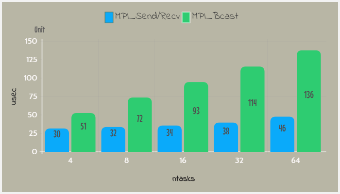
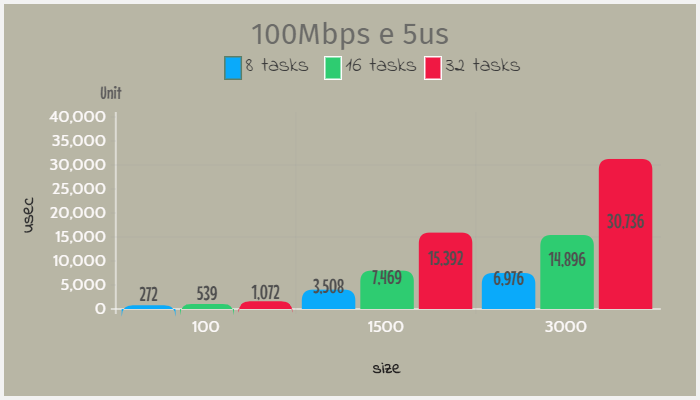
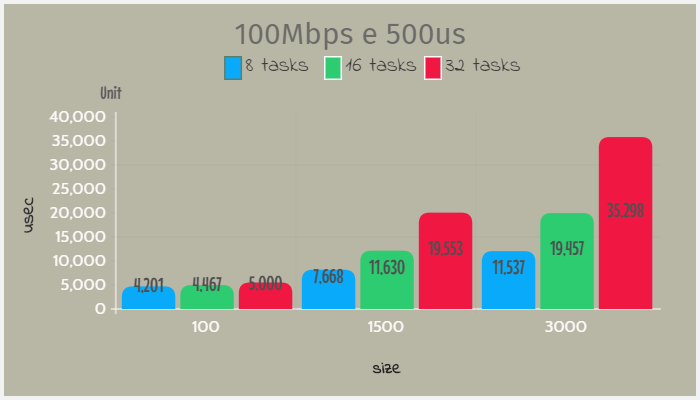
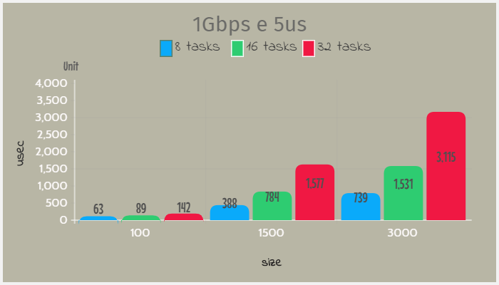
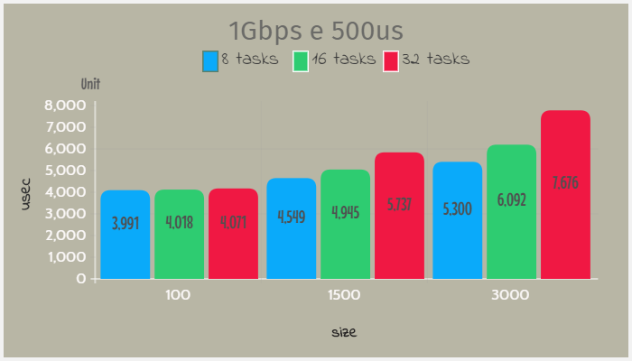

[Programação Paralela](https://github.com/AndreaInfUFSM/elc139-2019a) > T7

# Avaliação de desempenho de programas MPI

Nome: Adonai Gabriel Loreto Peres Gonçalves

Disciplina: ELC139 - Programação Paralela

- [Specs da máquina utilizada](specs.txt)

## Parte 1

Abaixo os algoritmos analisados e o gráfico gerado:
- [sr_bcast.c](sr_bcast.c) - MPI_Send e MPI_Recv
- [my_sr_bcast.c](my_sr_bcast.c) - MPI_Bcast

Os tempos de execução foram obtidos através da média de 10 execuções para cada configuração, onde a banda era de 125Mbps, latência de 5us e velocidade de 10GFlops.
Abaixo a tabela com os resultados obtidos:
- [resultsP1.csv](resultsP1.csv)

## Parte 2

Abaixo o algoritmo analisado e os gráficos gerados:
- [avg.c](avg.c)

Os tempos de execução foram obtidos através da média de 10 execuções para cada configuração, onde a velocidade era de 10GFlops.
Abaixo a tabela com os resultados obtidos:
- [resultsP2.csv](resultsP2.csv)

## Referências

- [Tutorial MPI](https://computing.llnl.gov/tutorials/mpi/)
- [MPI Send and Receive](http://mpitutorial.com/tutorials/mpi-send-and-receive/)
- [Open MPI Documentation](https://www.open-mpi.org/doc/)
- [SMPI CourseWare](https://simgrid.github.io/SMPI_CourseWare/)
- [SMPI - Describing the virtual platform](http://simgrid.gforge.inria.fr/simgrid/3.20/doc/platform.html)